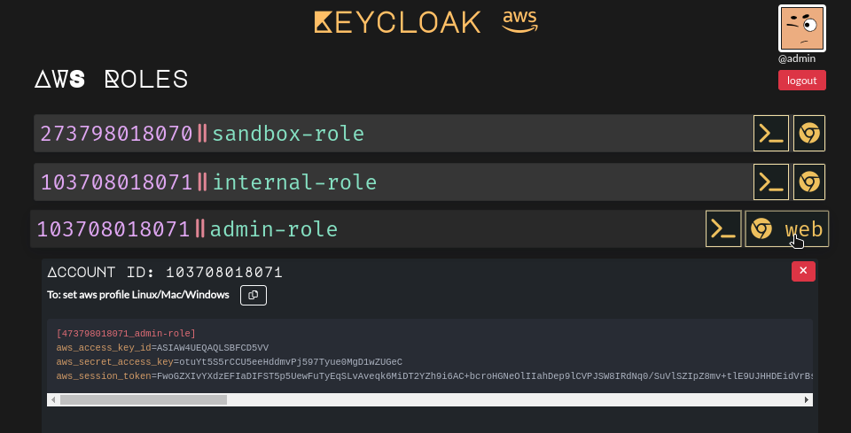
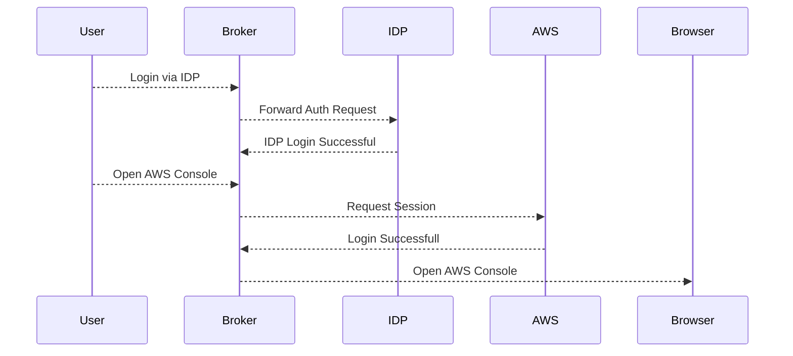

# AWS OpenID Credential Broker

OpenID Based Identity Credential Broker for AWS (Built as an alternative to AWS SSO to support OpenID Federation)




## Broker authentication flow 



## Getting Started

Quick Start with docker compose

```bash
docker-compose up -d
```

### Prerequisites

- python3
- virtualenv
- docker
- docker-compose


### Installing

A step by step series of examples that tell you how to get a development env running

Clone the Project 

```bash
git clone https://github.com/Rishang/aws-oidc-broker.git
```

Initialzing virtualenv

```bash
cd aws-oidc-broker
python -m venv venv
source ./venv/bin/activate
```

Installing Dependencies

```bash
pip install -r requirements.txt
```

Configure .env file or perform export of those variables

```bash
cp .env.example .env
```

Configure environment variables as required.

## Environment Variables for KEYCLOAK integration

| VARIABLE NAME | Example VALUE | DESCRIPTION | REQUIRED |
| --- | --- | --- | --- |
| `KEYCLOAK_CLIENT_ID` | `aws-oidc`| Client ID | yes |
| `KEYCLOAK_WELLKNOWN` | `https://example.dev/realms/test/.well-known/openid-configuration` | Keycloak well-known openid URL | yes |
| `APP_SECRET` | `!apppasswd` | optional env variable to set encrytion secret | no |
| `TITLE` | `Example Broker` | Title to display on Broker UI | no |

## Deployment

Add additional notes about how to deploy this on a live system

## Built With

- [Flask](https://flask.palletsprojects.com/) - The web framework used

- [VueJs](https://vuejs.org/) - The web framework for building web user interfaces.
