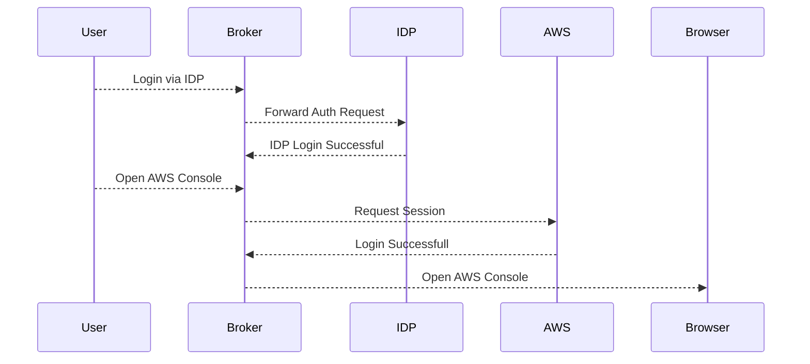

# Overview

Identity Broker for AWS is as an alternative to AWS SSO to support OpenID Federation.

!!! info

    The current implementation is done and tested with Keycloak. We are planning general purpose OIDC Intergration and with Standard Providers such as Okta, Auth, Google, etc..

## Features

- Simple and Secure
- CLI Credentials and Snippets for aws cli config, bash and powershell
- Console Login
- RBAC for any AWS Account in single place with Federated Identity Provider Configuration.
- Self Manged Deployment
- OpenSource. You can see what's going on and can customize for your own use. 

!!! note

    AWS SSO is a closed source and proprietary implemation and doesn't integrate well with External IDPs. Requires expensive support plan to learn and integrate and AWS Support engineers don't know anything out of their official docs.

## Auth Flow

