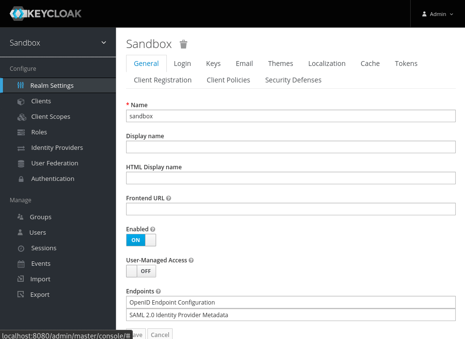

## Creating Client

- Download the client config file [here](../assets/aws-oidc-keycloak.json "download"){target=_blank}

- Open Keycloak Admin Console

- Go to Clients tab. Create new client

- On Client Creation page, import the downloaded config.

## Configuration

The Client will be created with default url `http://localhost:5000/login` for Valid Redirect URIs, Base URL, and Web Origins

Update this to your actual domain url e.g `https://aws.example.com/login`

## AWS Config

- Go to AWS IAM Console and add an Identity Provider

- Use following configuration

    - **Provider Type:** OpenID Connect
    - **Provider URL:** OIDC Provider URL, must be a internet accessible TLS secured enpoint (e.g `https://auth.example.com/realms/master` for Keycloak)
    - **Audience:** Client ID issued by OIDC Provider (e.g `aws-oidc` Keycloak Client )

    !!! info

            Ensure you add Provider URL without any Trailing slash `/`

- Get Thumbprint once `Provider URL` is set. and Click `Add provider`

